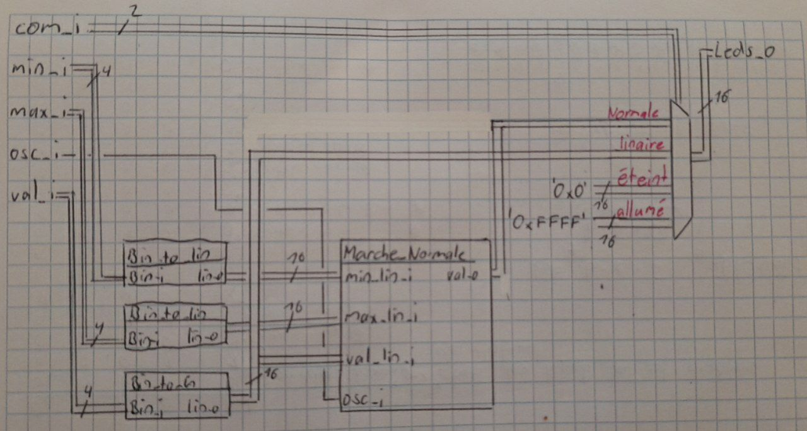
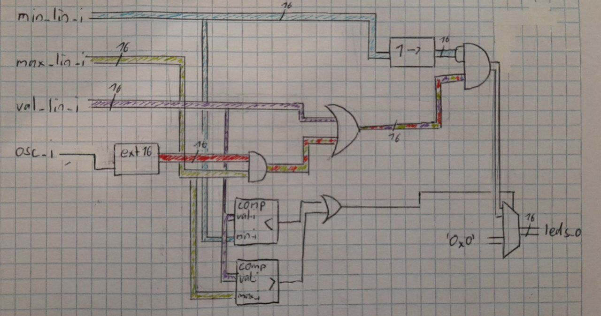

  
  

  
Laboratoire 02 - CSN

  
Affichage linéaire d’une valeur
entre deux bornes Min et Max

  
Auteur:

  
Denis Bourqui

  
Professeur:

  
Etienne Messerli

  
Ingénieur:

  
Sébastien Masle

   
  
Salle:

  
A07

## Introduction

Dans ce laboratoire nous allons faire un affichage de 3 nombres sur 16 leds. Ces 3 nombres seront min, val et max. Les leds de 0 à min (exclu) seront éteint. Les leds de de min à val seront allumé de intensité forte, et le leds de val (exclu) à max seront allumé d'intensité faible. 

Le montage à égalment 3 autres modes qui sont l'affichage linaire de val, le mode où tous les leds sont allumés et le mode où tous les leds sont éteint.

## Analyse

Pour le mode normale on découpe les 15 leds en 4 interval:

0 à min (éxclu) -> éteint
min à valeur -> allumé d'intensité forte
valeur (exclu) à max -> allumé d'intesité faible
max (exclu) à 15 -> éteint

Les valeurs min, val et max sont donnée en binaire (sur 4 bits). Pour les travailler je vais tout d'abbord les mettre en linaire.

#### TDV 

Cette TDV est par rapport à un bit dans les 3 bus de valeurs (linaire). (le bit X des 3 bus min(lin) val(lin) max(lin) )

**Signal d'entrée**

x : bit (0 à 15)
min(x) : bit x de la valeur min en linaire
val(x) : bit x de la valeur val en linaire
max(x) : bit x de la valeur max en linaire
s : signal d'oscillation

**Signal de sortie:**

led(x) : représente la led x (les lignes avec led(x) = A sont des cas où val est en déhors de l'interval min-max -> cas non possible à l'affichage. L'état de le la led sera à 0)

| S    | min(x) | max(x) | val(x) | led(x) | interval         |
| ---- | ------ | ------ | ------ | ------ | ---------------- |
| 0    | 0      | 0      | 0      | 0      | max (exclu) à 15 |
| 0    | 0      | 0      | 1      | A      |                  |
| 0    | 0      | 1      | 0      | **0**  | max (exclu) à 15 |
| 0    | 0      | 1      | 1      | 1      | min à valeur     |
| 0    | 1      | 0      | 0      | A      |                  |
| 0    | 1      | 0      | 1      | A      |                  |
| 0    | 1      | 1      | 0      | A      |                  |
| 0    | 1      | 1      | 1      | 0      | 0 à min (éxclu)  |
| 1    | 0      | 0      | 0      | 0      | max (exclu) à 15 |
| 1    | 0      | 0      | 1      | A      |                  |
| 1    | 0      | 1      | 0      | **1**  | max (exclu) à 15 |
| 1    | 0      | 1      | 1      | 1      | min à valeur     |
| 1    | 1      | 0      | 0      | A      |                  |
| 1    | 1      | 0      | 1      | A      |                  |
| 1    | 1      | 1      | 0      | A      |                  |
| 1    | 1      | 1      | 1      | 0      | 0 à min (éxclu)  |

#### Équation

Cette TDV nous donne l'équation suivante:

Led(x) = max(x) * val(x) * !min(x)  **+**  max(x) * !min(x)  * S = **max(x) * !min(x) * (val(x) + S)** 

#### Schéma sans détail du mode normale

On voit que tout d'abbord on met les valeurs d'entrée en linaire car pour la marche normale et le mode linaire, il nous faut ces signal en linaire. 

À droite il y a un multiplexeur qui choisit le mode à afficher sur le leds. 

#### Schéma du mode normale

Dans la partie basse on voit les comparateur qui détectent si la valeur n'est pas dans l'interval min -> max. Dans ce cas, le multiplexeur a droite choissisera la valeur 0x0 pour mettre sur le leds.

Dans la partie haute on voit l'inplémentation de la logique pour deffinir si une led est allumé en intensité forte, faible ou éteint. 

La valeur minimale doit étre shifté de une position a droite car il s'agit d'un interval éxclusive. 

Cette implémentation donne l'équation logique suivante: 

(max(x) * S + val(x)) * !min(x)
= max(x) * !min(x) * S + val(x) * !min(x) **-> on sait que si on se trouve dans l'interval MINàVAL on sera forcement dans l'interval MINàMAX. On peux donc augmenter notre équation comme suite: **

= max(x) * !min(x) * S + val(x) * !min(x) * max(x)

= max(x) * !min(x) * (S + val(x)) **-> Équation trouvé par la TDV**

## Proposition
## Conclusion

## Annexes

