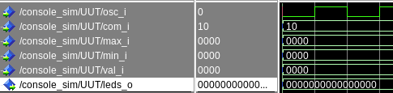

<div style="width=100%; border-bottom: 1px solid black;">
  
  
</div>

<div style=" text-align: center; clear right; line-height: 1;margin-top:200px;">
  <p style="font-size: 40px;">Laboratoire 02 - CSN</p>
  <p style="font-size:25px;">Affichage linéaire d’une valeur
entre deux bornes Min et Max</p>
</div>

<div style=" text-align: center; clear right; line-height: 0.5; margin-top:150px;">
  <p style="font-size: 20px; font-weight:bold">Auteur:</p>
  <p style="font-size:20px;">Denis Bourqui</p>
  <p style="font-size: 20px; font-weight:bold">Professeur:</p>
  <p style="font-size:20px;">Etienne Messerli</p>
  <p style="font-size: 20px; font-weight:bold">Ingénieur:</p>
  <p style="font-size:20px;">Sébastien Masle</p>
  </br>
  <p style="font-size: 16px; font-weight:bold">Salle:</p>
  <p style="font-size:16px;">A07</p>
</div>

<div style="page-break-after: always"></div>
## Introduction
Dans ce laboratoire nous allons faire un affichage de 3 nombres sur 16 leds. Ces 3 nombres seront min, val et max. Les leds de 0 à min (exclu) seront éteintes. Les leds de min à val seront allumées d’intensité forte, et les leds de val (exclu) à max seront allumées d'intensité faible. 
Le montage a également 3 autres modes qui sont l'affichage linaire de val, le mode où toutes les leds sont allumées et le mode où toutes les leds sont éteintes.
## Analyse
Pour le mode normal on découpe les 15 leds en 4 interval:
0 à min (exclu) -> éteinte
min à valeur -> allumée d'intensité forte
valeur (exclu) à max -> allumé d'intensité faible
max (exclu) à 15 -> éteint
Les valeurs min, val et max sont donnés en binaire (sur 4 bits). Pour les travailler je vais tout d'abord les mettre en linaire.
#### TDV 
Cette TDV est par rapport à un bit dans les 3 bus de valeurs (linaire). (le bit X des 3 bus min(lin) val(lin) max(lin) )
**Signal d'entrée**
x : bit (0 à 15)
min(x) : bit x de la valeur min en linaire
val(x) : bit x de la valeur val en linaire
max(x) : bit x de la valeur max en linaire
s : signal d'oscillation
**Signal de sortie:**
led(x) : représente la led x (les lignes avec led(x) = A sont des cas où val est en-dehors de l'interval min-max -> cas non possible à l'affichage. L'état de le la led sera à 0)

| S    | min(x) | max(x) | val(x) | led(x) | interval         |
| ---- | ------ | ------ | ------ | ------ | ---------------- |
| 0    | 0      | 0      | 0      | 0      | max (exclu) à 15 |
| 0    | 0      | 0      | 1      | A      |                  |
| 0    | 0      | 1      | 0      | **0**  | max (exclu) à 15 |
| 0    | 0      | 1      | 1      | 1      | min à valeur     |
| 0    | 1      | 0      | 0      | A      |                  |
| 0    | 1      | 0      | 1      | A      |                  |
| 0    | 1      | 1      | 0      | A      |                  |
| 0    | 1      | 1      | 1      | 0      | 0 à min (exclu)  |
| 1    | 0      | 0      | 0      | 0      | max (exclu) à 15 |
| 1    | 0      | 0      | 1      | A      |                  |
| 1    | 0      | 1      | 0      | **1**  | max (exclu) à 15 |
| 1    | 0      | 1      | 1      | 1      | min à valeur     |
| 1    | 1      | 0      | 0      | A      |                  |
| 1    | 1      | 0      | 1      | A      |                  |
| 1    | 1      | 1      | 0      | A      |                  |
| 1    | 1      | 1      | 1      | 0      | 0 à min (exclu)  |
#### Équation
Cette TDV nous donne l'équation suivante:
Led(x) = max(x) * val(x) * !min(x)  **+**  max(x) * !min(x)  * S = **max(x) * !min(x) * (val(x) + S)** 
#### Schéma sans détail du mode normal

On voit que tout d'abord on met les valeurs d'entrée en linaire, car pour la marche normale et le mode linaire, il nous faut ces signaux en linaire. 
À droite il y a un multiplexeur qui choisit le mode à afficher sur les leds. 
#### Schéma du mode normal

Dans la partie basse, on voit les comparateurs qui détectent si la valeur n'est pas dans l'interval min -> max. Dans ce cas, le multiplexeur à droite choissisera la valeur 0x0 pour mettre sur les leds.
Dans la partie haute, on voit l'implémentation de la logique pour définir si une led est allumée en intensité forte, faible ou éteint. 
La valeur minimale doit être shiftée d’une position à droite, car il s'agit d'un interval exclusif. 
Cette implémentation donne l'équation logique suivante: 
Led(x) = (max(x) * S + val(x)) * !min(x)
= max(x) * !min(x) * S + val(x) * !min(x) **-> on sait que si on se trouve dans l'interval MINàVAL on sera forcement dans l'interval MINàMAX. On peut donc augmenter notre équation comme suite: **
= max(x) * !min(x) * S + val(x) * !min(x) * max(x)
= max(x) * !min(x) * (S + val(x)) **-> Équation trouvée par la TDV.**
## Proposition
### Découpage des fichiers
La description VHDL est répartie en 3 fichiers. Ces fichiers se trouvent en annexes.
**min_max_top** correspond au premier schéma de l'analyse. Cette architecture est composée de blocs bin_lin et d'un bloc marche_normale.
**bin_lin_4to16** Ce bloc est du type flot_don et fait la conversion d'un nombre binaire à un nombre linaire.
**marche_normale** Cette entity correspond au deuxième schéma de l'analyse. Il décrit le comportement de la marche normale.
### Compilation avec Quartus
La compilation sur quartus fonctionne.
#### Vue RTL du TOP

On voit que la vue RTL est pratiquement la même que dans la conception. Le MUX par contre a été séparé en 2.
#### Vue RTL du bin_lin_4to16

Voici un aperçu de la RTL du convertisseur binaire->linaire. C'est une extension du convertisseur du labo précédent.
#### Vue RTL de la marche normale

Cette RTL est la même que dans la conception à la différence prête, que les bus ont été découpés en signal à 1 bit. 
### Simulation avec Questasim
##### Mode éteint

Avec la commande 10, toutes les leds sont éteintes.
##### Mode allumé fort

Avec la commande 11, toutes les leds sont allumées.
##### Mode linaire

Avec la commande 01 on affiche la valeur en linaire. Ici on voit que:
val = 0111 donne les leds 0000000011111111
val = 0000 donne les leds 0000000000000001
val = 1111 donne les leds 1111111111111111
##### Marche normal.

Ceci démontre la marche normale avec les mêmes valeurs que l'exemple sur la donnée.
On voit que les leds 15à13 et les leds 1à0 sont éteintes. Les leds 8à2 (val à min) sont allumées tous les cycles de osc. Les leds sont 12à9 sont allumées un cycle sur deux du signal osc.
##### Marche normale hors interval

Dès que la valeur est hors de l'interval min à max, toutes les leds sont éteintes.
#### Testbench avec Questasim
```Bash
# vsim -voptargs=""+acc"" work.min_max_top_tb
# Start time: 09:52:49 on Oct 07,2020
# ** Note: (vsim-8009) Loading existing optimized design _opt1
# Loading std.standard
# Loading std.textio(body)
# Loading ieee.std_logic_1164(body)
# Loading ieee.numeric_std(body)
# Loading work.min_max_top_tb(struct)#1
# Loading work.min_max_top(struct)#1
# Loading work.bin_lin_4to16(flot_don)#1
# Loading work.marche_normale(comport)#1
# Loading ieee.std_logic_textio(body)
# Loading work.min_max_top_tester(tester)#1
run -all
# ** Note: >> Debut de la simulation
#    Time: 500001 ns  Iteration: 0  Instance: /min_max_top_tb/tst
# ** Note: >> Nombre d'erreur(s) detectee(s): 0
#    Time: 8704500001 ns  Iteration: 0  Instance: /min_max_top_tb/tst
# ** Note: >> Bravo, votre composant à passé tous les cas.
#    Time: 8704500001 ns  Iteration: 0  Instance: /min_max_top_tb/tst
# ** Note: >> Fin de la simulation
#    Time: 8704500001 ns  Iteration: 0  Instance: /min_max_top_tb/tst
```
Le script Tb fonctionne correctement.
## Conclusion
La déscritpion fonctionne correctment en simulation ainsi que sur la carte.
## Annexes
### Fichiers VHDL
##### min_max_top.vhdl
```VHDL
-------------------------------------------------------------------------------
-- HEIG-VD, Haute Ecole d'Ingenierie et de Gestion du canton de Vaud
-- Institut REDS, Reconfigurable & Embedded Digital Systems
--
-- Fichier      : min_max_top.vhd
--
-- Description  :
--
-- Auteur       : Etienne Messerli
-- Date         : 29.09.2014
-- Version      : 0.0
--
-- Utilise      : Manipulation Min_Max pour cours CSN/ SysLog2
--
--| Modifications |------------------------------------------------------------
-- Version   Auteur Date               Description
-- 1.0       EMI    29.09.2014    Mise à jour avec new coding style
--
-------------------------------------------------------------------------------
library ieee;
  use ieee.std_logic_1164.all;
  use ieee.numeric_std.all;
-- Ne pas modifier cette entity
entity min_max_top is
    port(
        com_i  : in  std_logic_vector(1 downto 0);
        max_i  : in  std_logic_vector(3 downto 0);
        min_i  : in  std_logic_vector(3 downto 0);
        osc_i  : in  std_logic;
        val_i  : in  std_logic_vector(3 downto 0);
        leds_o : out std_logic_vector(15 downto 0)
        );
end min_max_top;
architecture struct of min_max_top is
    ----------------------------------
    -- Internal signal declarations --
    ----------------------------------
    signal lin_max_s : std_logic_vector(15 downto 0);
    signal lin_min_s : std_logic_vector(15 downto 0);
    signal lin_val_s : std_logic_vector(15 downto 0);
    signal val_normale_s : std_logic_vector(15 downto 0);

    ----------------------------
    -- Component Declarations --
    ----------------------------
    component bin_lin_4to16 is
        port (bin_i: in std_logic_vector(3 downto 0);
            lin_o : out std_logic_vector(15 downto 0));
    end component;

    component marche_normale is
        port (osc_i: in std_logic;
                min_lin_i : std_logic_vector(15 downto 0);
                max_lin_i : std_logic_vector(15 downto 0);
                val_lin_i : std_logic_vector(15 downto 0);
                val_o : out std_logic_vector(15 downto 0));
    end component;

    --------------------------------------
    -- Embedded configurations --
    --------------------------------------
    --for all : componentX use entity work.componentX;
    for all : bin_lin_4to16 use entity work.bin_lin_4to16(flot_don);
    for all : marche_normale use entity work.marche_normale(comport);
begin
    ----------------------------
    -- Instance port mappings --
    ----------------------------
    bin_lin_max : bin_lin_4to16 port map (bin_i => max_i,
                                            lin_o => lin_max_s);
    bin_lin_min : bin_lin_4to16 port map (bin_i => min_i,
                                            lin_o => lin_min_s);
    bin_lin_val : bin_lin_4to16 port map (bin_i => val_i,
                                            lin_o => lin_val_s);
    marche_normale_comp : marche_normale port map(osc_i => osc_i,
                                            min_lin_i => lin_min_s,
                                            max_lin_i => lin_max_s,
                                            val_lin_i => lin_val_s,
                                            val_o => val_normale_s);
    -- Affectation de sortie
    leds_o <= val_normale_s when com_i = "00" else
                lin_val_s  when com_i = "01" else
                x"0000" when com_i = "10" else
                x"ffff";
end struct;
```
##### bin_lin_4to6.vhdl
```VHDL
-- -----------------
-- Labo 2 CSN 2020
-- Auteur : Denis Bourqui
-- -----------------
library ieee;
use ieee.std_logic_1164.all;
use ieee.numeric_std.all;
entity bin_lin_4to16 is
        port (bin_i: in std_logic_vector(3 downto 0);
            lin_o : out std_logic_vector(15 downto 0));
end bin_lin_4to16;
architecture flot_don of bin_lin_4to16 is
begin
        lin_o(0) <= '1' when  true  else
                    '0';
        lin_o(1) <= '1' when  bin_i >= "0001"  else
                    '0';
        lin_o(2) <= '1' when  bin_i >= "0010" else
                    '0';
        lin_o(3) <= '1' when  bin_i >= "0011" else
                    '0';
        lin_o(4) <= '1' when  bin_i >= "0100" else
                    '0';
        lin_o(5) <= '1' when  bin_i >= "0101" else
                    '0';
        lin_o(6) <= '1' when  bin_i >= "0110" else
                    '0';
        lin_o(7) <= '1' when  bin_i >= "0111" else
                    '0';
        lin_o(8) <= '1' when  bin_i >= "1000"  else
                    '0';
        lin_o(9) <= '1' when  bin_i >= "1001"  else
                    '0';
        lin_o(10) <= '1' when  bin_i >= "1010" else
                    '0';
        lin_o(11) <= '1' when  bin_i >= "1011" else
                    '0';
        lin_o(12) <= '1' when  bin_i >= "1100" else
                    '0';
        lin_o(13) <= '1' when  bin_i >= "1101" else
                    '0';
        lin_o(14) <= '1' when  bin_i >= "1110" else
                    '0';
        lin_o(15) <= '1' when  bin_i = "1111" else
                    '0';
end flot_don;
```
##### marche_normale.vhdl
```VHDL
-- -----------------
-- Labo 2 CSN 2020
-- Auteur : Denis Bourqui
-- -----------------
library ieee;
use ieee.std_logic_1164.all;
use ieee.numeric_std.all;
entity marche_normale is
        port (osc_i: in std_logic;
                min_lin_i: std_logic_vector(15 downto 0);
                max_lin_i: std_logic_vector(15 downto 0);
                val_lin_i: std_logic_vector(15 downto 0);
                val_o : out std_logic_vector(15 downto 0));
end marche_normale;
architecture comport of marche_normale is
    signal osc_extented_s : std_logic_vector(15 downto 0);
    signal shifted_min_s :std_logic_vector(15 downto 0);
begin
    -- Extension du osc sur 16 bits
    osc_extented_s <= (others => osc_i);
    -- Décallage du min 
    shifted_min_s <= '0' & min_lin_i(min_lin_i'high downto 1);
    val_o <= x"0000" when val_lin_i < min_lin_i or val_lin_i > max_lin_i else -- hors de intervalles
                ((osc_extented_s and max_lin_i) or val_lin_i) and not shifted_min_s; -- marche normale
end comport;
```