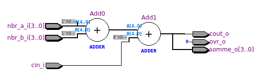

<div style="width=100%; border-bottom: 1px solid black;">
  
  
</div>


<div style=" text-align: center; clear right; line-height: 0.5;margin-top:200px;">
  <p style="font-size: 40px;">
    Laboratoire 03 - CSN
  </p>
  <p style="font-size:25px;">
    Exercices Addititions vhdl
  </p>
</div>


<div style=" text-align: center; clear right; line-height: 0.5; margin-top:300px;">
  <p style="font-size: 20px; font-weight:bold">Auteur:</p>
  <p style="font-size:20px;">Denis Bourqui</p>
  <p style="font-size: 20px; font-weight:bold">Professeur:</p>
  <p style="font-size:20px;">Etienne Messerli</p>
  <p style="font-size: 20px; font-weight:bold">Ingénieur:</p>
  <p style="font-size:20px;">Sébastien Masle</p>
  </br>
  <p style="font-size: 16px; font-weight:bold">Salle:</p>
  <p style="font-size:16px;">A07</p>
</div>

<div style="page-break-after: always"></div>
## Vue RTL

#### Etape 1 d'Addition 4 bits


### Avec Carry out


### Avec la constante générique




### Overflow


##### Resultat du TB pour full

```Bash
# vcom -reportprogress 300 -work work ../src_tb/add4_full_tb.vhd 
# -- Loading package STANDARD
# -- Loading package TEXTIO
# -- Loading package std_logic_1164
# -- Loading package NUMERIC_STD
# -- Compiling entity add4_tb
# -- Compiling architecture test_bench_full of add4_tb
# -- Loading entity add4full
# ** Warning: ../src_tb/add4_full_tb.vhd(59): (vcom-1236) Shared variables must be of a protected type.
# End time: 17:44:00 on Oct 16,2020, Elapsed time: 0:00:00
# Errors: 0, Warnings: 1
# End time: 17:44:01 on Oct 16,2020, Elapsed time: 0:00:16
# Errors: 0, Warnings: 0
# vsim -voptargs=""+acc"" work.add4_tb 
# Start time: 17:44:01 on Oct 16,2020
# ** Note: (vsim-8009) Loading existing optimized design _opt2
# Loading std.standard
# Loading std.textio(body)
# Loading ieee.std_logic_1164(body)
# Loading ieee.numeric_std(body)
# Loading work.add4_tb(test_bench_full)#1
# Loading work.add4full(flot_don)#1
run -all
# ** Note: D�but de la simulation
#    Time: 0 ns  Iteration: 0  Instance: /add4_tb
# ** Note: Nombre d'erreurs d�tect�es = 0
#    Time: 51200 ns  Iteration: 0  Instance: /add4_tb
# ** Note: Fin de la simulation
#    Time: 51200 ns  Iteration: 0  Instance: /add4_tb
```

