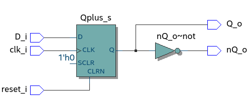
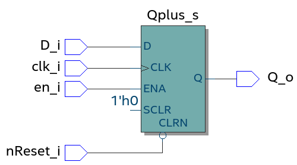
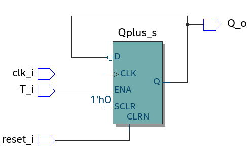
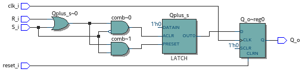

<div style="width=100%; border-bottom: 1px solid black;">
  
  
</div>


<div style=" text-align: center; clear right; line-height: 0.5;margin-top:200px;">
  <p style="font-size: 40px;">
    Laboratoire 05 - CSN
  </p>
  <p style="font-size:25px;">
    Description d'éléments mémoire en VHDL
  </p>
</div>

<div style=" text-align: center; clear right; line-height: 0.5; margin-top:300px;">
  <p style="font-size: 20px; font-weight:bold">Auteur:</p>
  <p style="font-size:20px;">Denis Bourqui</p>
  <p style="font-size: 20px; font-weight:bold">Professeur:</p>
  <p style="font-size:20px;">Etienne Messerli</p>
  <p style="font-size: 20px; font-weight:bold">Ingénieur:</p>
  <p style="font-size:20px;">Sébastien Masle</p>
  </br>
  <p style="font-size: 16px; font-weight:bold">Salle:</p>
<p style="font-size:16px;">A07</p>
</div>


<div style="page-break-after: always"></div>
## DFF AR

```VHDL
architecture comport of dff_ar is
   signal Qplus_s : std_logic;

begin

   process(reset_i, clk_i)
   begin
     if (reset_i = '1') then
      Qplus_s <= '0';
     elsif Rising_Edge(clk_i) then
      Qplus_s <= D_i;
     end if;
     
   end process;
   Q_o <= Qplus_s;
   nQ_o <= not Qplus_s;
  
end comport;
```




```Bash
# vsim -voptargs=""+acc"" work.dff_ar_tb 
# Start time: 10:14:03 on Nov 04,2020
# ** Note: (vsim-3813) Design is being optimized due to module recompilation...
# Loading std.standard
# Loading std.textio(body)
# Loading ieee.std_logic_1164(body)
# Loading work.dff_ar_tb(test_bench)#1
# Loading work.dff_ar(comport)#1
run -all
# ** Note: >> Debut de la simulation
#    Time: 0 ns  Iteration: 0  Instance: /dff_ar_tb
# ** Note: >>Nombre d'erreur détectée = 0
#    Time: 552 ns  Iteration: 0  Instance: /dff_ar_tb
# ** Note: >>Fin de la simulation
#    Time: 552 ns  Iteration: 0  Instance: /dff_ar_tb
```

## DFF EN

```vhdl
architecture comport of dff_en is
   signal Qplus_s : std_logic;


begin

  process(nReset_i, clk_i)
  begin
    if (nReset_i = '0') then
     Qplus_s <= '0';
    elsif Rising_Edge(clk_i) and (en_i = '1')  then
     Qplus_s <= D_i;
    end if;
    
  end process;
  Q_o <= Qplus_s;

end comport;
```




```bash
# vsim -voptargs=""+acc"" work.dff_en_tb 
# Start time: 10:27:12 on Nov 04,2020
# ** Note: (vsim-3813) Design is being optimized due to module recompilation...
# Loading std.standard
# Loading std.textio(body)
# Loading ieee.std_logic_1164(body)
# Loading work.dff_en_tb(test_bench)#1
# Loading work.dff_en(comport)#1
run -all
# ** Note: >> Debut de la simulation
#    Time: 0 ns  Iteration: 0  Instance: /dff_en_tb
# ** Note: >>Nombre d'erreur détectée = 0
#    Time: 652 ns  Iteration: 0  Instance: /dff_en_tb
# ** Note: >>Fin de la simulation
#    Time: 652 ns  Iteration: 0  Instance: /dff_en_tb
```

## Flipflop T

```vhdl
architecture comport of flipflop_t is
  signal reset_s : std_logic;
  signal Qplus_s : std_logic;
  signal D_s : std_logic;
begin
  --Adaptation polarite
  reset_s <= reset_i;
  D_s <= (not Qplus_s) when T_i = '1' 
          else Qplus_s;

  process(reset_s, clk_i)
  begin
    if (reset_s = '1') then
     Qplus_s <= '0';
    elsif Rising_Edge(clk_i)then
     Qplus_s <= D_s;
    end if;
  end process;


  Q_o <= Qplus_s;

end comport;
```





```bash
# vsim -voptargs=""+acc"" work.flipflop_t_tb 
# Start time: 10:33:00 on Nov 04,2020
# ** Note: (vsim-3812) Design is being optimized...
# Loading std.standard
# Loading std.textio(body)
# Loading ieee.std_logic_1164(body)
# Loading work.flipflop_t_tb(test_bench)#1
# Loading work.flipflop_t(comport)#1
run -all
# ** Note: >> Debut de la simulation
#    Time: 0 ns  Iteration: 0  Instance: /flipflop_t_tb
# ** Note: >>Nombre d'erreur détectée = 0
#    Time: 652 ns  Iteration: 0  Instance: /flipflop_t_tb
# ** Note: >>Fin de la simulation
#    Time: 652 ns  Iteration: 0  Instance: /flipflop_t_tb
```

## Flipflop RS

```vhdl
architecture comport of flipflop_rs is
  signal Qplus_s : std_logic;
begin
  Qplus_s <= '1' when S_i = '1'
            else '0' when R_i = '1' 
            else Qplus_s;

  process(reset_i, clk_i)
  begin
    if (reset_i = '1') then
      Q_o <= '0';
    elsif Rising_Edge(clk_i) then
      Q_o <= Qplus_s;
    end if;
  end process;
  

end comport;
```




```Bash
# vsim -voptargs=""+acc"" work.flipflop_rs_tb 
# Start time: 11:22:04 on Nov 04,2020
# ** Note: (vsim-3812) Design is being optimized...
# Loading std.standard
# Loading std.textio(body)
# Loading ieee.std_logic_1164(body)
# Loading work.flipflop_rs_tb(test_bench)#1
# Loading work.flipflop_rs(comport)#1
run -all
# ** Note: >> Debut de la simulation
#    Time: 0 ns  Iteration: 0  Instance: /flipflop_rs_tb
# ** Error: Lors verif Sortie, synch
#    Time: 448 ns  Iteration: 0  Instance: /flipflop_rs_tb
# ** Error: Lors verif Sortie, asynch
#    Time: 498 ns  Iteration: 0  Instance: /flipflop_rs_tb
# ** Note: >>Nombre d'erreur détectée = 2
#    Time: 1352 ns  Iteration: 0  Instance: /flipflop_rs_tb
# ** Note: >>Fin de la simulation
#    Time: 1352 ns  Iteration: 0  Instance: /flipflop_rs_tb
```

