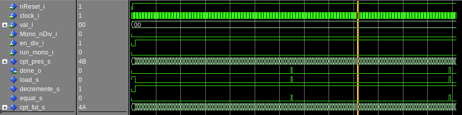

<div style="width=100%; border-bottom: 1px solid black;">
  
  
</div>

<div style=" text-align: center; clear right; line-height: 0.5;margin-top:200px;">
  <p style="font-size: 40px;">
    Laboratoire 02 - CSN
  </p>
  <p style="font-size:25px;">
    titre du laboratoire
  </p>
</div>
<div style=" text-align: center; clear right; line-height: 0.5; margin-top:300px;">
  <p style="font-size: 20px; font-weight:bold">Auteur:</p>
  <p style="font-size:20px;">Denis Bourqui</p>
  <p style="font-size: 20px; font-weight:bold">Professeur:</p>
  <p style="font-size:20px;">Etienne Messerli</p>
  <p style="font-size: 20px; font-weight:bold">Ingénieur:</p>
  <p style="font-size:20px;">Sébastien Masle</p>
  </br>
  <p style="font-size: 16px; font-weight:bold">Salle:</p>
  <p style="font-size:16px;">A07</p>
</div>
<div style="page-break-after: always"></div>
## Introduction
Dans ce laboratoire nous allons implémenter un timer représentant un périphérique timer qui fournit un signal après un certain nombre de coups de clock.
Nous avons 2 modes de fonctionnement:
* Mode mono : Le timer écoule une seule fois, met le signal de fin à 1 et le maintien.
* Mode diviseur : Le timer est en mode périodique. À chaque fin de période, il met le signal done à 1 pendant un coup de clock.  
## Analyse
Si on découpe le problème dans les deux parties, on voit qu'on a deux séquences de comptages. Pour diminuer la logique utilisée dans les comparateurs de fin on va décrémenter et s’arrêter à une valeur constante plutôt qu’incrémenter est s’arrêter à val.
* Pour le mode diviseur: val -> à 1 par décrémenter de 1
* Pour le mode mono: val -> à 0 par décrémenter de 1
### États internes
#### Division
Voici un chronogramme du mode Division:

(Avec wavedrome il n'est pas possible de faire les flancs asynchrones. Imaginez donc que les flancs des signaux sur fond rouge seront toujours un peut avant la monté de la clock).
**Explications**
* Tant que en_div_i n'est pas actif, on load la val_i dans le compteur.
* Dès que en_div_i devient actif, on commence à décrémenter. (la première séquence sera un coup de clock trop court)
* Quand le compteur arrive à 0x1, on va mettre **done_o** à 1 et faire un load pour un coup de clock.
* Ensuite on va à nouveau décrémenter jusqu'à 1 et ainsi de suite.
* Quand **en_div_i** tombe à 0, on arrête de décrémenter et on réarme (load) le compteur. 
#### Mono
Voici un chronogramme du mode Mono:

(Avec wavedrome il n'est pas possible de faire les flancs asynchrones. Imaginez donc que les flancs des signaux sur fond rouge seront toujours un peut avant la monté de la clock).
**Explications**
* Tant qu'on n’active pas le mode mono (avec run_mono_i) on **load** val_i dans le registre.
* Quand run_mono_i va passer à 1, on va commencer à décrémenter la valeur du registre à chaque coup de clock. 
* Quand le compteur est à 0 on va monter le **done_o** et **maintenir** 
* Quand run_mono_i tombe à 0 on réarmer (**load**) le registre 
### Fonctions
Le registre contiendra toujours la valeur de val, tant qu’aucune des deux modes et actif. Il sera donc toujours "armé". Cela implique que val_i soit stable un coup de clock avant qu'un mode soit activé.
* Mode Mono: 
  Dans le mode Mono on va décrémente jusqu'à 0 et maintenir le 0 jusqu'à ce que run_mono_i tombe à 0. À ce moment on va réarmer le compteur avec la valeur (load). 
  * Load (Prio 1)
  * Décrémente ( Prio 2)
  * Maintien (Prio 3)
* Mode diviseur:
  Dans le mode Divisieur on décrémente jusqu'à 1, recharger la valeur initiale et à nouvau décrémente.
  * Load (Prio 1)
  * Décrément (Prio 2)
### Fonctions en modes des entrées
On va créer un signal interne qui sera actives lors que la valeur du compteur a atteint la fin (0 en mode mono, 1 en mode division)
| Mono_nDiv_i | en_div_i | run_mono_i | equal_s | Function   | Explication                                  |
| ----------- | -------- | ---------- | ------- | ---------- | -------------------------------------------- |
| 0           | 0        | -          | -       | load       | Aucun mode actif                             |
| 0           | 1        | -          | 0       | Décrément | Mode diviseur actif, compteur pas fini       |
| 0           | 1        | -          | 1       | load       | Mode diviseur actif, compteur fini, rearmage |
| 1           | -        | 0          | -       | load       | Mode Mono, mais pas démarré                  |
| 1           | -        | 1          | 0       | Décrément | Mode Mono actif, compteur pas fini           |
| 1           | -        | 1          | 1       | Maintien   | Mode Mono actif, compteur fini               |
### Tables Karnaugh pour les fonctions
Si on n’est pas dans l'état load, ni dans l'état décrément, on sera forcement dans l'état maintien. Pas besoin de faire une table Karnaugh.
#### Load
|                              | !run_mono_i * !equal_s <br />=> 00 | !run_mono_i * equal_s <br />=> 01 | un_mono_i * equal_s <br />=> 11 | !run_mono_i * !equal_s <br />=> 10 |
| ---------------------------- | ---------------------------------- | --------------------------------- | ------------------------------- | ---------------------------------- |
| !Mono_nDiv * !en_div_i => 00 | 1                                  | 1                                 | 1                               | 1                                  |
| !Mono_nDiv * en_div_i => 01  | 0                                  | 1                                 | 1                               | 0                                  |
| Mono_nDiv * en_div_i => 11   | 1                                  | 1                                 | 0                               | 0                                  |
| Mono_nDiv * !en_div_i => 10  | 1                                  | 1                                 | 0                               | 0                                  |
load = !Mono_nDiv * !en_div_i + Mono_nDiv * !run_mono_i  + !Mono_nDiv * equal_s
#### Décrémente
Vu que "load" est plus prioritaire, décrémente peut être de n'importe quel état quand load est actif.
|                              | !run_mono_i * !equal_s <br />=> 00 | !run_mono_i * equal_s <br />=> 01 | un_mono_i * equal_s <br />=> 11 | run_mono_i * !equal_s <br />=> 10 |
| ---------------------------- | ---------------------------------- | --------------------------------- | ------------------------------- | --------------------------------- |
| !Mono_nDiv * !en_div_i => 00 | -                                  | -                                 | -                               | -                                 |
| !Mono_nDiv * en_div_i => 01  | 1                                  | -                                 | -                               | 1                                 |
| Mono_nDiv * en_div_i => 11   | -                                  | -                                 | 0                               | 1                                 |
| !Mono_nDiv * en_div_i => 10  | -                                  | -                                 | 0                               | 1                                 |
Décrémente = run_mono_i * !equal_s + !Mono_nDiv * en_div_i
### Logisim
#### Décodage des états
Voici la logique combinatoire que ça nous fait pour les fonctions:

 #### Décodage de la valeur future
Voici la logique pour la valeur future du compteur

#### Décode de valeur de sortie 
Voici comment **done_o** est décodé. Le signal qui arrive depuis en haut est la valeur du compteur (registre) actuel.

## Proposition
Avec ces schémas Logisim, on peut directement commencer à décrire notre structure en VHDL (la description complète est dans les annexes):
```VHDL
begin
   -- Decodage d'état future
   
   equal_s <=  '1' when (Mono_nDiv_i = '1' and cpt_pres_s = "0") else
               '1' when (Mono_nDiv_i = '0' and cpt_pres_s = "1") else
               '0';
   -- load = !Mono_nDiv * !en_div_i + Mono_nDiv * !run_mono_i  + !Mono_nDiv * equal_s
   load_s <=   '1' when (Mono_nDiv_i  = '0' and en_div_i = '0')
               or (Mono_nDiv_i = '1' and en_div_i = '0')
               or (Mono_nDiv_i = '0' and equal_s = '1')
     else '0';
   -- Décrémente = run_mono_i * !equal_s + !Mono_nDiv * en_div_i
   decremente_s <=   '1' when (en_div_i = '1' and Mono_nDiv_i = '0') 
                     or (run_mono_i = '1' and equal_s = '0')
       else '0';
   cpt_fut_s <=   unsigned(val_i) when load_s = '1' else -- Etat Load
                  cpt_pres_s - 1 when decremente_s = '1' else -- Etat decremente
                  cpt_pres_s; -- Etat maintien
   
   -- Registre
   process(clock_i, nReset_i)
   begin
      if(nReset_i = '0') then
         cpt_pres_s <= "0000000";
      elsif Rising_Edge(clock_i) then
         cpt_pres_s <= cpt_fut_s;
      end if;
   end process;
   -- Decodeur de sortie
   done_o <= equal_s;
end comport;
```
### Tests manuel
```Bash
do ../run_timer_top_sim.tcl
# ** Warning: (vlib-34) Library already exists at "work".
# QuestaSim-64 vmap 2020.1_1 Lib Mapping Utility 2020.03 Mar  4 2020
# vmap work work 
# Modifying /opt/questa/questasim/linux_x86_64/../modelsim.ini
# QuestaSim-64 vcom 2020.1_1 Compiler 2020.03 Mar  4 2020
# Start time: 16:31:21 on Nov 20,2020
# vcom -reportprogress 300 -work work ../src/timer_top.vhd 
# -- Loading package STANDARD
# -- Loading package TEXTIO
# -- Loading package std_logic_1164
# -- Loading package NUMERIC_STD
# -- Compiling entity timer_top
# -- Compiling architecture comport of timer_top
# End time: 16:31:21 on Nov 20,2020, Elapsed time: 0:00:00
# Errors: 0, Warnings: 0
```
#### Mode Division
Voici un chronogramme du fonctionnement en mode division. On voit qu'on on active le signale run_mono_i on se met dans l'état décrémente. Comme précisé dans l'analyse le premier cycle est un coup de clock trop court. Après cela on boucle de 3 à 1 avec un cycle done_o=1 quand on est à 1. 
Le tout s'arrête et se réarme dès qu'on met en_div_i à 0.

#### Mode Mono
**Fonctionnement normal**
On voit sur ce chronogramme que dès que run_mono_i monte à 1 on a bien (val_i - 1) cycles d'attente et le done_o qui vient après. Il sera maintenu tant que run_mono_i est actif.
On voit aussi que Mono_nDiv n'a pas besoin d'arriver en même temps que run_mono_i.

**Réarmage en cas de run_mono_i tombe à 0**
Dans le chronogramme suivant on a interrupté le fonctionnement du mode mono en remettant le run_mono_i à 0 lors du décrémentage. On voit que le compteur est réarmé. 
On voit aussi que Mono_nDiv_i peut venir en même temps que run_mono_i.

### val_i spécial
##### val_i = 0
**Mode Mono:** 1) on charge 0 dans le registre. 2) Done_o sera immédiatement (non synchrone) à 1 car (done_o <= equal_s <= cpt_actuel == 0x0) et donc il fait un maintient/load permanent tant que run_mono_i et Mono_nDiv_i sont activé. Autrement dit: done_o <= run_mono_i + Mono_nDiv_i.  On pourrais ajouter une contrainte sur done_o: De ne pas mettre à 1 si (val_i = 0 mais run_mono_i  = 0). 

**Mode Div : **1) on charge 0 dans le registre. 2) Vu qu'on compare le compteur à 0x1 il va décrémenter le compteur et passer à 127. Depuis là il va continuer jusqu'à 1, mettre le done et recommencer à 0x0. Autrement dit il nous fait 128 cycles avant d'avoir le done_o.


##### val_i = 1
**Mode Mono:** 1) on charge 1 dans le registre. 2) On va faire val_i-1 cylces (donc 0) avant que done_o sera à 1. Mais il sera synchrone! Il va retomber dès que run_mono_i tombe à 0 car il y aura à nouveau 1 qui sera chargé dans le compteur.

Mode Div: 1) on charge 1 dans le registre. 2) done_o deviendra immédiatement à 1. Cela vient du faite que done_o <= cpt == 0x1. Il n'y pas de condition qui vérifie que en_div_i est activé.


#### Tests avec le TB
```bash
# vsim -voptargs=""+acc"" work.timer_top_tb 
# Start time: 17:31:47 on Nov 20,2020
# ** Note: (vsim-3813) Design is being optimized due to module recompilation...
# Loading std.standard
# Loading std.textio(body)
# Loading ieee.std_logic_1164(body)
# Loading ieee.numeric_std(body)
# Loading work.timer_top_tb(struct)#1
# Loading work.timer_top(comport)#1
# Loading work.timer_top_tester(test_bench)#1
# ** Warning: (vsim-8713) Suspect default binding for component instance 'tst'.
# Entity has no generics at all; the component has generic:
#           mode_normal_optionnel
#    Time: 0 ns  Iteration: 0  Instance: /timer_top_tb/tst File: ../src_tb/timer_top_tb.vhd Line: 100
run -all
# ** Note: Debut simulation
#    Time: 0 ns  Iteration: 0  Instance: /timer_top_tb/tst
# ** Note: Done pas verifie
#    Time: 98 ns  Iteration: 0  Instance: /timer_top_tb/tst
# ** Note: Done pas verifie
#    Time: 148 ns  Iteration: 0  Instance: /timer_top_tb/tst
# ** Note: Done pas verifie
#    Time: 198 ns  Iteration: 0  Instance: /timer_top_tb/tst
# ** Note: Done pas verifie
#    Time: 248 ns  Iteration: 0  Instance: /timer_top_tb/tst
# ** Note: Done pas verifie
#    Time: 298 ns  Iteration: 0  Instance: /timer_top_tb/tst
# ** Note: Done pas verifie
#    Time: 348 ns  Iteration: 0  Instance: /timer_top_tb/tst
# ** Note: Done pas verifie
#    Time: 398 ns  Iteration: 0  Instance: /timer_top_tb/tst
# ** Note: Done pas verifie
#    Time: 126798 ns  Iteration: 0  Instance: /timer_top_tb/tst
# ** Note: Done pas verifie
#    Time: 126848 ns  Iteration: 0  Instance: /timer_top_tb/tst
# ** Note: Done pas verifie
#    Time: 126898 ns  Iteration: 0  Instance: /timer_top_tb/tst
# ** Note: Done pas verifie
#    Time: 126948 ns  Iteration: 0  Instance: /timer_top_tb/tst
# ** Note: Done pas verifie
#    Time: 126998 ns  Iteration: 0  Instance: /timer_top_tb/tst
# ** Error: Lors verif Sortie, asynch
#    Time: 168698 ns  Iteration: 0  Instance: /timer_top_tb/tst
# ** Error: Lors verif Sortie, synch
#    Time: 168748 ns  Iteration: 0  Instance: /timer_top_tb/tst
# ** Note: >>----------------------------------------
#          >>  Nombre d'erreurs detectees = 0
#          >>----------------------------------------
#    Time: 168752 ns  Iteration: 0  Instance: /timer_top_tb/tst
# ** Note: >>--------------------------------------->>
#          >>                                       >>
#          >>    Bravo votre systeme fonctionne     >>
#          >>                                       >>
#          >>--------------------------------------->>
#    Time: 168752 ns  Iteration: 0  Instance: /timer_top_tb/tst
# ** Note: >>Fin de la simulation
#    Time: 168752 ns  Iteration: 0  Instance: /timer_top_tb/tst
```

#### Quartus
```
Flow Status Successful - Fri Nov 20 17:36:10 2020
Quartus Prime Version 20.1.0 Build 711 06/05/2020 SJ Standard Edition
Revision Name timer_top
Top-level Entity Name timer_top
Family MAX V
Device 5M570ZF256C5
Timing Models Final
Total logic elements 12 / 570 ( 2 % )
Total pins 13 / 159 ( 8 % )
Total virtual pins 0
UFM blocks 0 / 1 ( 0 % )
```
Quantité de logique utilisé: 2% (12/570)
##### RTL

On voit qu'il fait les choses très semblable à nous. 2 mux's sont utilisé pour décoder l'état future du compteur et 1 utilisé définir le done_o. Par contre il utilise 2 comparateur et met le mux après et pas avant les comparateurs.
## Conclusion
Le système est fonctionnel. Il serait néanmoins important de préciser à l'utilisateur limites par rapport à la valeur que val_i peut prendre.
## Annexes
timer_top.vhd
```vhdl
-------------------------------------------------------------------------------
-- HEIG-VD, Haute Ecole d'Ingenierie et de Gestion du canton de Vaud
-- Institut REDS, Reconfigurable & Embedded Digital Systems
--
-- Fichier      : timer_top.vhd
--
-- Description  : Realisation d'un timer avec 2 modes de fonctionnement
--                (diviseur ou monostable)
-- 
-- Auteur       : Etienne Messerli
-- Date         : 10.11.2017
-- Version      : 0.0
-- 
-- Utilise      : Manipulation Timer pour cours CSN, 2017
-- 
--| Modifications |------------------------------------------------------------
-- Ver   Auteur Date               Description
-- 1     Denis Bourqui  20.11.2020  Labo 06
--
-------------------------------------------------------------------------------
library ieee;
use ieee.std_logic_1164.ALL;
use ieee.numeric_std.ALL;
entity timer_top is
   port( 
      clock_i      : in   std_logic;
      nReset_i     : in   std_logic;
      Mono_nDiv_i  : in   std_logic;
      en_div_i     : in   std_logic;
      run_mono_i   : in   std_logic;
      val_i        : in   std_logic_vector(6 downto 0);
      done_o       : out  std_logic
   );
end timer_top ;
architecture comport of timer_top is
   signal cpt_fut_s, cpt_pres_s : unsigned (6 downto 0);
   signal load_s, decremente_s, equal_s : std_logic;
   
begin
   -- Decodage d'état future
   
   equal_s <=  '1' when (Mono_nDiv_i = '1' and cpt_pres_s = "0") else
               '1' when (Mono_nDiv_i = '0' and cpt_pres_s = "1") else
               '0';
   -- load = !Mono_nDiv * !en_div_i + Mono_nDiv * !run_mono_i  + !Mono_nDiv * equal_s
   load_s <=   '1' when (Mono_nDiv_i  = '0' and en_div_i = '0')
               or (Mono_nDiv_i = '1' and en_div_i = '0')
               or (Mono_nDiv_i = '0' and equal_s = '1')
     else '0';
   -- Décrémente = run_mono_i * !equal_s + !Mono_nDiv * en_div_i
   decremente_s <=   '1' when (en_div_i = '1' and Mono_nDiv_i = '0') 
                     or (run_mono_i = '1' and equal_s = '0')
       else '0';
   cpt_fut_s <=   unsigned(val_i) when load_s = '1' else -- Etat Load
                  cpt_pres_s - 1 when decremente_s = '1' else -- Etat decremente
                  cpt_pres_s; -- Etat maintien
   
   -- Registre
   process(clock_i, nReset_i)
   begin
      if(nReset_i = '0') then
         cpt_pres_s <= "0000000";
      elsif Rising_Edge(clock_i) then
         cpt_pres_s <= cpt_fut_s;
      end if;
   end process;
   -- Decodeur de sortie
   done_o <= equal_s;
end comport;
```